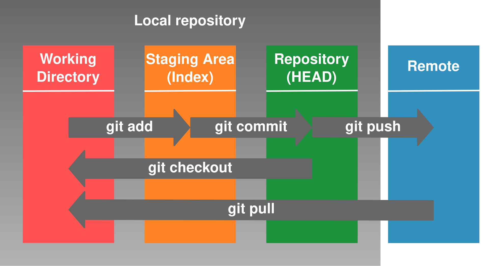
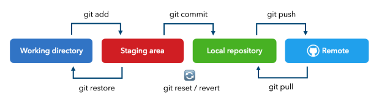

# Workshops - Git & GitHub

---

## **1. O que é Git e GitHub?**

### **Git**
Git é um sistema de controle de versão. Ele permite que você registre o histórico de mudanças em arquivos do seu projeto, como se fosse um “salvamento com rastreamento”. Assim, você pode:

- Voltar no tempo se algo der errado.
- Trabalhar em diferentes ideias (ramificações ou *branches*).
- Colaborar com outras pessoas sem bagunçar o código.

### **GitHub**
É um site que armazena repositórios Git na nuvem. Ele permite que pessoas compartilhem projetos, colaborem e façam backup de seus códigos.

**Analogia:**  
Imagine que Git é seu caderno de anotações local. O GitHub seria a nuvem onde você salva cópias dele para não perder nada e compartilhar com outras pessoas.

---

## **2. Conceitos Fundamentais**

### **Repositório**
Um repositório é como a “pasta do projeto”. Nele ficam os arquivos e o histórico de todas as modificações.

- **Repositório Local**: está na sua máquina.
- **Repositório Remoto**: está na nuvem (por exemplo, no GitHub).

### **Área de Trabalho (Working Directory)**
É onde você edita os arquivos normalmente no VS Code. Tudo o que está visível pra você está na área de trabalho.

### **Área de Staging (Index)**
É como uma “lista de arquivos prontos para o próximo salvamento (commit)”. Você escolhe o que vai salvar agora.

### **Commit**
É como uma “foto” do seu código naquele momento. Ao fazer um *commit*, você salva tudo que estava na área de staging com uma mensagem explicando o que foi feito.

### **Push**
Você envia suas alterações (commits) do repositório local para o GitHub (repositório remoto).

### **Pull**
Você baixa alterações que estão no GitHub para sua máquina.

### **Branch**
Uma *branch* (ramo) é uma versão paralela do projeto. Serve para testar ou desenvolver algo novo sem interferir no código principal.

### **Pull Request**
É um pedido para unir sua *branch* com outra (geralmente a principal). No GitHub, você faz isso quando quer que suas mudanças sejam revisadas e aprovadas.



---

## **3. Configurando o Ambiente**

1. **Instale o Git**: [https://git-scm.com](https://git-scm.com)
2. **Crie uma conta no GitHub**: [https://github.com](https://github.com)
3. **Instale o VS Code**: [https://code.visualstudio.com](https://code.visualstudio.com)

---

## **4. Primeiros Passos no VS Code com Git**

### **Passo a passo**

#### A) Iniciar um repositório local

1. Crie uma pasta chamada `meu-projeto`.
2. Abra no VS Code: `Arquivo > Abrir Pasta`.
3. No terminal do VS Code:
   ```bash
   git init
   ```
   Isso cria o repositório local (a pasta `.git`).

#### B) Crie um arquivo qualquer para compor seu projeto. Neste exemplo, estamos iniciando um projeto front-end com `index.html`.

```html
<!DOCTYPE html>
<html>
  <head><title>Meu Projeto</title></head>
  <body><h1>Olá mundo!</h1></body>
</html>
```

#### C) Verifique o status

```bash
git status
```

Você verá que seu arquivo está na área de trabalho, mas ainda não foi adicionado ao Git.

#### D) Adicione à área de staging

```bash
git add index.html
```

Agora o Git está “preparando” esse arquivo para salvar no histórico.

#### E) Faça o commit

```bash
git commit -m "Primeiro commit com HTML inicial"
```

Você acabou de salvar uma versão do projeto com esse conteúdo.

---

## **5. Subindo para o GitHub**

1. No GitHub, crie um novo repositório (sem README).
2. Copie a URL (ex: `https://github.com/usuario/meu-projeto.git`).
3. No terminal:
   ```bash
   git remote add origin https://github.com/usuario/meu-projeto.git
   git branch -M main
   git push -u origin main
   ```

Agora seu projeto está no GitHub!



---

## **6. Criando e Trabalhando com Branches**

1. Criar uma nova branch:
   ```bash
   git checkout -b nova-feature
   ```
2. Faça mudanças no seu código (ex: adicione um novo botão).
3. Adicione e faça commit normalmente:
   ```bash
   git add .
   git commit -m "Adiciona botão de contato"
   git push -u origin nova-feature
   ```

---

## **7. Fazendo Pull Request no GitHub**

1. Acesse o repositório no GitHub.
2. Vá na aba “Pull Requests” > “New Pull Request”.
3. Escolha sua branch como origem e `main` como destino.
4. Escreva uma descrição e clique em “Create Pull Request”.

Agora alguém pode revisar seu código antes de juntar tudo.

---

## **8. Usando o painel *Projects***

1. No GitHub, vá na aba **Projects**.
2. Clique em “New project” e escolha o tipo Kanban.
3. Crie colunas como:
   - To Do
   - Em Progresso
   - Concluído
4. Crie cartões para tarefas (issues) e vá movendo conforme o andamento.

---

## **Links Úteis***

### 📚 Guias e Tutoriais Escritos

- **Guia Prático de Git (Roger Dudler)**  
 Um guia direto ao ponto, ideal para iniciantes. Explica comandos essenciais como `git init`, `git add`, `git commit`, `git push`, além de ramificações e merges. Disponível em português  
  🔗 [Acessar guia](https://rogerdudler.github.io/git-guide/index.pt_BR.html)

- **Recursos de Aprendizagem do GitHub**  
 A própria plataforma GitHub oferece cursos interativos gratuitos, incluindo tutoriais práticos e feedback automátic.  
  🔗 [Ver recursos](https://docs.github.com/pt/get-started/start-your-journey/git-and-github-learning-resources)
---

### 🎥 Vídeos e Cursos Gratuitos

- **Curso de Git e GitHub para Iniciantes (YouTube)** 
  Curso completo que cobre desde os conceitos básicos até comandos prátcos.  
  🔗 [Assistir no YouTube](https://www.youtube.com/watch?v=Yp0RRTdtkqY)

- **Git e GitHub Tutorial Completo - Introdução Prática para Iniciantes*  
  Explicação clara e didática sobre os fundamentos do Git e GtHub.  
  🔗 [Ver vídeo](https://www.youtube.com/watch?v=_hZf1teRFNg)

- **Git e GitHub para Analistas e Engenheiros de Dados com Fabric*  
  Voltado para profissionais de dados que utilizam ferramentas como Power BI e abric.  
  🔗 [Assistir aula](https://www.youtube.com/watch?v=wFimCGpndOc)
